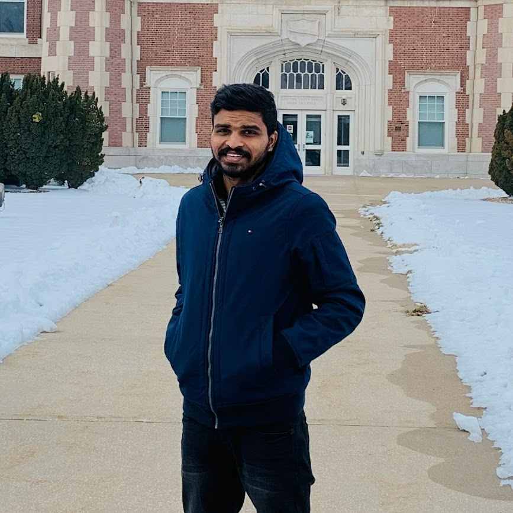

# Pramod Reddy Gonegari

My interest in the field of Computers and the dream of innovating new Technologies
captivated me to choose the Bachelor’s Degree in Information Technology. Pursuing
Undergraduate in Information Technology, I acquired an overall perspective of this scientific
discipline. It has given me the opportunity to meet people with similar interests and understand
Education is about implementing what we are taught rather than just a mere presentation on Paper.
I was fascinated by the concepts in subjects like Object-Oriented Programming, Data Structures,
Design and Analysis of Algorithms, thinking how much they revolutionized the Technological
Industry. The excellent lab facilities helped me to practically work and apply such concepts to
develop my understanding of programming. Being a member of Innovation Cell, an initiative by
our College for Student interaction improved my logical ability towards coding and share diverse
ideas. My belief in the practical approach and self-learning gained me a job offer from one of
Asia’s largest Companies, TCS, as an Assistant System Engineer.

